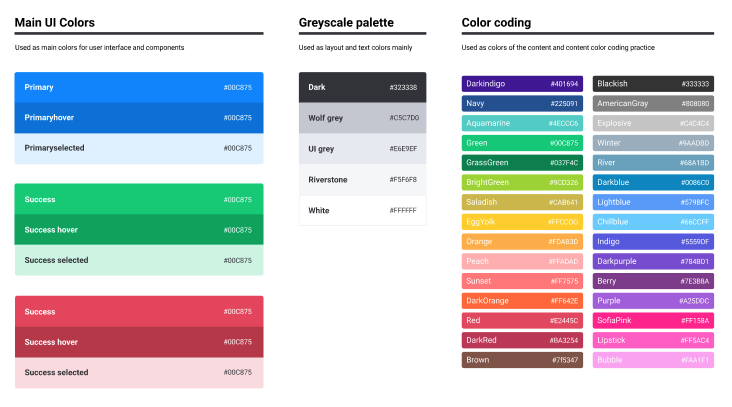

# 6 - 命名设计标记

既然我们已经确定了设计人员和开发人员将协作将设计规范手动存储为设计令牌，那么我们来谈谈如何将设计规范转换为设计令牌，即如何将设计规范转换为键值对 这将是 JSON 对象的一部分。

这抽象的说起来容易，但不是一件简单的事。 创建键和值时需要考虑很多因素。 正因为如此，我们将在单独的一章中解决每一个问题。 现在，让我们专注于创建密钥或命名我们的设计令牌。

你会记得，设计标记可以分为两种类型：简单标记和组合标记（也称为组件）。

简单标记是代表设计系统有效值枚举的设计标记，例如调色板、排版等。

组合标记是简单标记的组合，指定在特定上下文中应如何使用值。

例如，monday.com UI Kit 在 Figma 文件中指定了以下调色板：



这表示设计系统的有效颜色列表。 查看设计文件时很容易想到简单的标记。

例如，这里有一些你可以创建的设计标记：

```css
{
    "color.primary": "...",
    "color.success": "...",
    "color.dark: "...",
    "color.darkRed: "..."
}
```

现在，你是否在颜色类型前面加上颜色或颜色？ 你用的是 kebab-case 还是 snake_case？

Style Dictionary 不会受到这些决定的影响。 这归结为设计师和开发人员的最佳想法。 没有团队是相同的，所以你们必须一起讨论。 你只想考虑清楚和简洁是你正在寻找的。 最终，开发人员将通过平台可交付成果使用这些设计代币。 只要足够清楚设计标记所指的是什么，就让它尽可能简短以符合开发人员的喜好。

通常，简单标记可以遵循 CSS 属性的命名约定。 例如：

```css
{
    "border.radius.sm": "...",
    "border.radius.md": "...",
    "border.radius.lg": "..."
}
```

然而，情况并非总是如此。 例如，你可能希望将 margin 和 padding 规范组合成一个通用间距前缀：


同样，这必须在设计人员和开发人员之间进行讨论。 没有正确的答案。

在 monday.com 示例中并非如此，但想象一下指定 color.primary 和具有相同值 #192BC2 的 color.blue 的设计文件。 你会存储一个 color.primary 和一个 color.blue 设计标记吗？ 是的。 事实上，这提出了一个重要的观点，即设计令牌中存在层次结构。 即使是简单的标记也可能引用另一个简单标记的值。 在我们的示例中，color.primary 将引用与 color.blue 相同的值。 你可以同时包括两者，但消费应用程序将引用 color.primary 标记。 这样，如果 color.primary 更改为引用 color.purple 的值，则不必更新代码库中的所有引用。 不过，两者兼有很好，因此样式字典包含与设计文件匹配的有效颜色的完整枚举。 但同样，没有正确答案。

然而，当涉及到组件令牌时，命名决策变得更加复杂。 你不再只是描述一个值。 相反，你是在描述一个值和该值所在的上下文。 例如，component.button.color 是设计标记的名称或键，描述按钮上颜色的应用。 由于 UI 元素/组件具有各种状态（如加载、错误、悬停、活动等）和潜在变体（如主要、次要和第三），因此想出一个名称并非易事。

鉴于这种复杂性，并且由于设计令牌迄今为止没有官方命名约定，因此尝试实施设计令牌的公司都提出了自己的命名约定。 换句话说，他们都提出了自己的标记化语言。

Nathan Curtis 有一篇非凡的文章总结了 Salesforce、Shopify、Adobe、Orbit 等公司的所有不同方法。 让我尝试总结一些要点。

首先，他为分隔符周围的东西提供了一个有用的标签。 他称它们为水平。 因此，color.primary 有两个级别，color 和 primary。

其次，他将关卡分为以下几组：

基本级别作为令牌的骨干，结合了类别（例如，颜色）、概念（操作）和属性（大小）。 修饰符级别指的是变量（主要）、状态（悬停）、比例（100）和模式（暗）中的一个或多个。 对象级别引用组件（按钮）、组件内的元素（左图标）或组件组（表单）。 命名空间级别结合了系统 (esds)、主题（海洋或子品牌）或域（零售）的任何（或全部，在极端情况下！）。 我会建议在设计系统上一起工作的任何一组设计师和开发人员通读本文并自行确定他们最喜欢的方法。 每个团队都是不同的，没有正确或错误的答案。 但是，需要牢记一些关键原则。

首先，设计令牌的名称应该清晰而简短。 只要名称具有足够的描述性，就不要添加不必要的级别。 例如，如果 primary、default 和 light 是默认值，则不要执行 component.button.color.primary.default.light。

其次，顺序不是一门精确的科学，但它确实很重要。 Nathan Curtis 建议命名空间级别首先出现，然后是对象、级别，然后是基本级别，最后是修饰符级别。

在继续下一章之前，查看 Nathan Curtis 的文章可能会有所帮助。 浏览现有的设计系统，并考虑如何根据本文中的示例和原则为设计令牌命名。 但是，如果这需要考虑很多，请不要气馁。 请记住，你并不孤单。 真实场景中的整个过程将是设计人员和开发人员之间的协作。 要成为在设计系统团队中工作的成功开发人员，你只需要了解问题、了解解决方案并发起对话。