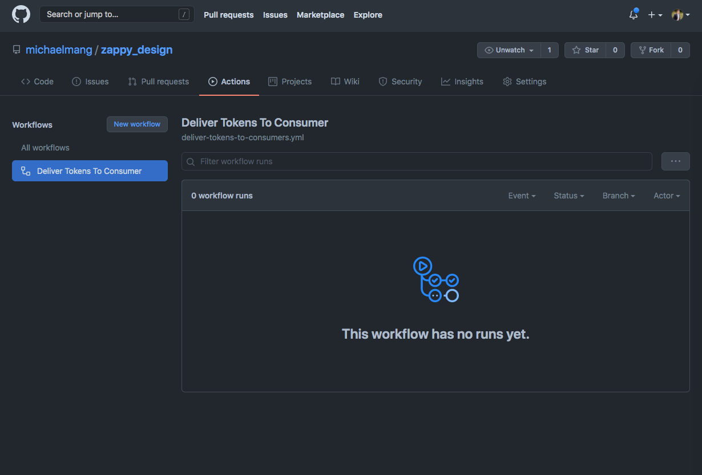

# 9 - 交付设计令牌

好的，我们已经学习了如何使用样式字典将设计令牌转换为平台可交付成果。 难题的最后一部分是学习如何将这些可交付成果交付/导出到消费应用程序。

让我们考虑一下我们如何解决这个问题的选择。

我看到其他公司采用了四种现实的选择。

一种选择是将样式字典变成可安装的包。 导入包将使您能够访问平台可交付成果：

1 从 'zappy-design' 导入 { js, scss };
我不喜欢这个选项，因为它似乎首先违背了拥有风格字典的全部目的。 使用 Style Dictionary，我们可以导出适用于 Android 的标记。 但是，Android 编码人员将无法使用 npm 包。 该解决方案似乎不灵活，无法超越 Web 平台。

另一种选择是创建 API。 从理论上讲，每个消费应用程序都可以有一个脚本来调用 API 并请求它感兴趣的平台可交付成果。例如，一个 Node 应用程序可以有一个脚本来请求我们在上一章中创建的 JavaScript 模块。 不利的一面是要么必须有一个流程来通知所有消费应用程序更新已经发生并且新的可交付成果可用;要么 或者，每个应用程序都必须进行例行检查。

第三种选择是创建 CLI。 过程和缺点与之前的选项相同。

虽然前两个选项足够灵活，可以跨任何目标平台和消费应用程序的技术工作，但还有更好的方法（在我看来）。 我建议您构建工具，以便在触发构建时自动将 Style Dictionary 编写的平台可交付成果复制到所有使用应用程序的存储库。 在本章中，我们将使用 GitHub Actions 创建此方法的概念验证。

GitHub Actions 允许您……

直接在您的存储库中自动化、自定义和执行您的软件开发工作流……您可以发现、创建和共享操作以执行您喜欢的任何工作，包括 CI/CD，并在完全自定义的工作流中组合操作。

基本上，GitHub 操作在被"事件"触发后启动工作流程。 工作流是步骤的组合，这些步骤执行操作以使用您的代码完成特定工作。 每个工作流可以并行运行多个作业。


例如，您可以设置一个事件，当代码被推送到一个分支时，它将运行您的单元测试并报告状态。

这些操作将在必须指定的虚拟环境中运行。 您可以在此处了解有关虚拟环境的更多信息。

让我们创建一个工作流，以便在 Style Dictionary 生成平台可交付成果时将其交付给消费应用程序。

首先，我们将添加一个 YAML 文件，其中包含我们工作流程的代码：

```sh
mkdir .github/workflows
touch .github/workflows/deliver-tokens-to-consumers.yml
```

.github/workflows 是一个特定的目录，它将通知 GitHub 初始化目录中的工作流。

如果您不熟悉 YAML，我建议您阅读它。 基本要点是它是一种数据序列化语言，如 JSON。 这是指定配置的流行选择。 显然，GitHub 也喜欢它。 如果您感到困惑，请不要担心。 GitHub 有关于操作的工作流语法的可靠文档。

接下来，我们可以为我们的工作流程添加一个名称：

```yaml
name: Deliver Tokens To Consumer
```

然后，我们可以指定要触发工作流的事件。 您可以在此处查看可以触发工作流的所有可能事件。

在我们的例子中，我们希望在构建路径上推送平台可交付成果时触发工作流：

```yaml
name: Deliver Tokens To Consumer

on:
  push:
    paths:
      - 'build/**'
```

最后，我们将为我们的工作流程提供一项检查我们的代码并将构建路径复制到另一个 GitHub 存储库（公司中使用应用程序的存储库）上的路径的工作：

```yaml
name: Deliver Tokens To Consumer

on:
  push:
    paths:
      - 'build/**'

jobs:
# Add a job for every additional consumer/application
  deliver_to_react_application:
    runs-on: ubuntu-latest
    steps:
      - uses: actions/checkout@v2
      - name: Deliver Platform Deliverable To Application
      uses: andstor/copycat-action@v3
      with:
        # See documentation: https://docs.github.com/en/actions/reference/encrypted-secrets
        # Set the secret in the "src" repository
        personal_token: ${{ secrets.API_TOKEN_GITHUB }}
        # You may need to change this to "main"
        src_branch: main
        src_path: build/js/_variables.js
        # Replace with your repository owner. Most likely, this is your GitHub username.
        dst_owner: michaelmang
        dst_repo_name: consume-style-dictionary-github-actions
        # You may need to change this to "main"
        dst_branch: master
        dst_path: tokens/_variables.js
        commit_message: Update design tokens
```

在这里，我们指定了一个名为 deliver_to_react_application 的作业以及具有 runs-on 属性的虚拟环境。

每个作业都有一系列步骤。 第一步是使用预定义的 GitHub Actions 步骤。 即，在虚拟环境中检查我们存储库代码的操作/检查步骤。 您可以在此处查看完整的预定义步骤集。

然后，我们使用一个名为 copycat-action 的用户自定义步骤。 此步骤允许您将文件从您的存储库复制到另一个存储库。 我们使用它来将封装我们设计标记的内置 JavaScript 变量复制到另一个存储库。

就是这样！

由于每个应用程序只对接收由 Style Dictionary 生成的特定类型的平台可交付成果感兴趣，因此我们可以为每个应用程序创建一个单独的"作业"。

GitHub Actions 中的作业默认并行运行。

因此，在新平台可交付成果的推动下，每个需要使用这些可交付成果之一的应用程序都将在工作流中完成一项工作，将所需的可交付成果复制到其存储库中。

这意味着对于每个使用样式字典的新应用程序，我们只需在工作流中添加一个新作业，以便它们与设计令牌的更改保持同步。

为了测试这一点，让我们创建一个虚拟存储库 consume-style-dictionary-github-actions。 在 GitHub 上初始化这个新存储库后，您需要阅读工作流文件中的注释。

您需要按照文档在 zappy-design 存储库上创建 GitHub 个人访问令牌。 这授予 copycat-action 步骤从 zappy-design 存储库复制代码的权限。 确保将其命名为 API_TOKEN_GITHUB 以使工作流代码正常工作。

您还需要将 dst_owner 替换为刚刚初始化的虚拟存储库的存储库所有者。 这很可能是您的 GitHub 用户名。

最后，您可能需要将分支更新为 main 而不是 master。

让我们将本章的当前代码推送到 GitHub。

导航到"操作"选项卡。 您应该看到我们的工作流程已经注册：



现在，我们需要更改构建目录以触发此工作流。

对 build/js/_variables.js 文件进行更改（我在文件末尾添加了一行）。 然后，推动这些变化。

您应该会看到工作流已被触发，希望您最终会看到它起作用了：


现在，转到虚拟存储库，您应该会看到它起作用了！


恭喜！ 您现在知道如何将设计令牌转换并交付给公司中的任何消费应用程序！

以下是本章的更改。

这是一个 PR，其中包含对虚拟存储库的更改。